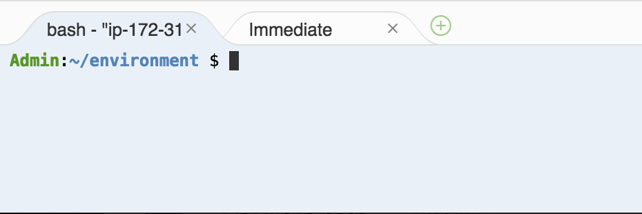

# eb-tomcat-snakes
Tomcat application that shows the use of RDS in a Java EE web application in AWS Elastic Beanstalk. The project shows the use of Servlets, JSPs, Simple Tag Support, Tag Files, JDBC, SQL, Log4J, Bootstrap, Jackson, and Elastic Beanstalk configuration files.

## INSTRUCTIONS

### Note that this lab guide is meant for AWS Lab Accounts, please follow [this lab guide](https://github.com/aws-samples/eb-tomcat-snakes) if you are using your own AWS account.
### IMPORTANT: Please kindy read the section on Prerequisites - Lab Environment before starting the lab.

### AWS Cloud9 IDE - Set up

AWS Cloud9 is a cloud-based integrated development environment (IDE) that lets you write, run, and debug your code with just a browser. It includes a code editor, debugger, and terminal. Cloud9 comes pre-packaged with essential tools for popular programming languages and the AWS Command Line Interface (CLI) pre-installed so you don't need to install files or configure your laptop for this workshop. Your Cloud9 environment will have access to the same AWS resources as the user with which you logged into the AWS Management Console.

Take a moment now and setup your Cloud9 development environment.

### ✅  Step-by-step Instructions

1. Go to the AWS Management Console, click **Services** then select **Cloud9** under Developer Tools.
2. Click **Create environment**.
3. Enter `MyDevEnvironment` into **Name** and optionally provide a **Description**.
4. Click **Next step**.
5. You may leave **Environment settings** at their defaults of launching a new **t2.micro** EC2 instance which will be paused after **30 minutes** of inactivity.
6. Click **Next step**.
7. Review the environment settings and click **Create environment**. It will take several minutes for your environment to be provisioned and prepared.
8. Once ready, your IDE will open to a welcome screen. Below that, you should see a terminal prompt similar to:  You can run AWS CLI commands in here just like you would on your local computer. Verify that your user is logged in by running the following command.

```console
user:~/environment $ aws sts get-caller-identity
```

You'll see output indicating your account and user information:
```console
{
    "Account": "123456789012",
    "UserId": "AKIAI44QH8DHBEXAMPLE",
    "Arn": "arn:aws:iam::123456789012:user/user"
}
```

Keep your AWS Cloud9 IDE opened in a tab throughout this workshop as we'll use it for activities like cloning, pushing changes to repository and using the AWS CLI.

### Setup Git Credentials for Cloud9

Before we start to clone the Repo, we need to configure the AWS CLI credential helper to manage the credentials for connections to your CodeCommit repository. The AWS Cloud9 development environment comes with AWS managed temporary credentials that are associated with your IAM user. You use these credentials with the AWS CLI credential helper.

1. Update the packages within your AWS Cloud9 instance.
```console
user:~/environment $ sudo yum update -y

```
2. Configure your chosen user name and email to be associated with your Git commits by running the git config command. For example:
```console
user:~/environment $ git config --global user.name "Mary Major"
user:~/environment $ git config --global user.email mary.major@example.com
```
3. Run the following commands to configure the AWS CLI credential helper for HTTPS connections:
```console
user:~/environment $ git config --global credential.helper '!aws codecommit credential-helper $@'
user:~/environment $ git config --global credential.UseHttpPath true
```
***

### To download, build and deploy the project
Using Cloud9 Terminal, run the following commands to clone and build the source code.

Clone the project:

	~$ git clone https://github.com/awslabs/eb-tomcat-snakes.git

Run ``build.sh`` to compile the web app and create a WAR file:

	~$ cd eb-tomcat-snakes
	~/eb-tomcat-snakes$ ./build.sh

**IMPORTANT**
Always run build.sh from the root of the project directory.

**Once you have compiled/build the project, download the WAR file (ROOT.war) to your local machine from Cloud9 IDE to deploy into Elastic Beanstalk using the AWS Console.**

You can use either the AWS Management Console to launch the compiled WAR (ROOT.war). 

##### To deploy with the AWS Management Console
1. Open the [Elastic Beanstalk Management Console](https://console.aws.amazon.com/elasticbeanstalk/home)
2. Choose *Create New Application*.
3. For *Application Name*, type **tomcat-snakes**. Choose *Create*.
4. Click on Actions Button and selet Create Environment. Choose *Web Server Environment*.
5. Set the platform, preconfigured platform to *Tomcat*.
6. Select Upload your code for Application code, click *Upload* and *Choose File*.
7. Upload *ROOT.war* which was downloaded earlier and choose *Next*.
8. Click *Configure more options*.
9. Select Configuration presets to be *High Availability*.
10. Find *Database* and choose *Modify*.
11. Apply the following RDS settings and choose *Next* (leave the other settings default):
    - DB engine: *postgres*
    - Engine version: *9.4.7*
    - Instance class: *db.t2.micro*
    - Master username: any username
    - Master password: any password
12. Leave the rest of the DB settings as defaults and click *Save*
13. Choose **Create Environment** to create the environment. 

The process takes about 15 minutes. If you want to save time during the initial environment creation, you can launch the environment without a database, and then add one after the environment is running from the Configuration page. Launching an RDS DB instance takes about 10 minutes.

## Site Functionality
The application is a simple Java EE site that uses simple tags, tag files, and an SQL database hosted in an external database in Amazon Relational Database Service (Amazon RDS).

The front page is a very basic introduction with a little bit of Javascript. All pages use a tag file for the header, and Bootstrap CSS for mobile friendly rendering.

The **Browse Movies** page shows a list of movies from the database generated with a simple tag.

The **Add a Movie** page is a form that lets a user add a movie to the database. It takes a movie name, link to IMDB or IMDB movie ID (e.g. tt0118615), and a boolean value that indicates whether the movie has snakes in it or not. Form input is validated with a regex in the movies model.

The **Search** page lets you perform a basic search for a movie with full name matches only.

## Database Use
The application can connect to an RDS DB instance that is part of your Elastic Beanstalk environment, or an independent RDS DB instance that you launched outside of Elastic Beanstalk. 

**(OPTIONAL)** To connect to an external DB instance, configure Environment Properties for each of the connection variables (RDS_HOST, etc), or store the full connection string in a JSON file in Amazon S3. 

The application looks for a table named movies. If it doesn't find one, it creates a new table and seeds it a with a few entries read from a JSON file included in the source bundle.

## Log4j
The application uses Log4j to generate a log file named ``snakes.log``. The project includes a configuration file in ``src/.ebextensions`` that configures Elastic Beanstalk to include ``snakes.log`` when you request tailed logs.

## Project Contents

This project is organized as follows (some files not shown):

	├── LICENSE             - License
	├── README.md           - This file
	├── build.sh            - Build script
	└── src
	    ├── .ebextensions   - Elastic Beanstalk configuration files
	    ├── 404.jsp         - 404 error JSP
	    ├── add.jsp         - Add a Movie JSP
	    ├── default.jsp     - Home Page JSP
	    ├── movies.jsp      - Movies JSP
	    ├── search.jsp      - Search JSP
	    ├── WEB-INF
	    │   ├── lib         - Library JARs for JSP and Servlet APIs, Jasper, Log4J and PostgreSQL
	    │   ├── tags        - Header tag file
	    │   │   └── header.tag
	    │   ├── tlds        - Tag Library Descriptor for ListMovies simple tag
	    │   │   └── movies.tld
	    │   ├── log4j2.xml  - Log4J configuration file
	    │   └── web.xml     - Deployment descriptor
	    ├── com
	    │   └── snakes
	    │       ├── model   - Model classes
	    │       │   ├── Media.java
	    │       │   └── Movie.java
	    │       └── web     - Servlet and simple tag classes
	    │           ├── AddMovie.java
	    │           ├── ListMovies.java
	    │           └── SearchMovies.java
	    ├── css             - Stylesheets
	    │   ├── movies.html - HTML page for testing stylesheet changes
	    │   └── snakes.css  - Custom styles
	    ├── images          - Some royalty free images for the header and front page
	    └── js              - Bootstrap and parallax effect javascript
  
### build.sh
The build script simply compiles each class with the Java Compiler ``javac`` and packages the compiled classes and other files into a Web ARchive named ``ROOT.war``. ``ROOT`` indicates that the app will run at the root path of the site that Tomcat serves. 

***NOTE*** When you deploy a WAR file to an Elastic Beanstalk environment, it is extracted during the deployment process and runs at the root path regardless of the name of the file. Elastic Beanstalk only runs apps at other paths if you package multiple WAR files into a ZIP archive and deploy that.

Only files required to run the application are included in the WAR. Uncompiled java classes and configuration files in ``.ebextensions/inactive`` are excluded.

A Windows version of the build script ``build-windows.sh`` is also included. Note that the classpath arguments are separated by semicolons instead of colons.

